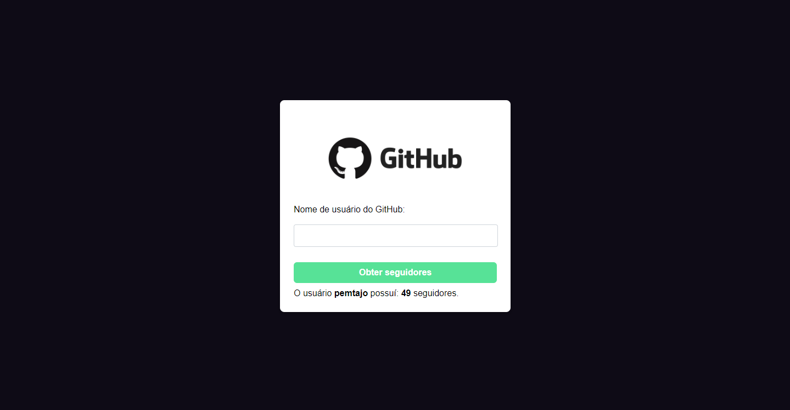

<h1> <b>Lambda no Google Cloud</b> </h1>



<br>

## **Documentação da Função Lambda**
### **Descrição**
A função Lambda tem como objetivo obter a quantidade de seguidores de um usuário do GitHub. Ela faz uma requisição à API do GitHub para obter informações sobre o usuário e retorna o número de seguidores.

### **Entrada**
A função Lambda recebe um parâmetro username que representa o nome de usuário do GitHub a ser consultado.

### **Saída**
A função retorna um valor inteiro representando a quantidade de seguidores do usuário do GitHub.

### **Dependências Externas**
A função depende da API do GitHub para obter as informações do usuário. Certifique-se de que a função tenha permissões adequadas para acessar a API.

### **Instruções de Execução**
- Clone o repositório do código fonte.
- Certifique-se de ter as dependências necessárias instaladas.
- Abra o arquivo index.php no seu editor de código.
- Verifique se as configurações de conexão com a API do GitHub estão corretas.
- Execute o código PHP em um servidor web compatível com PHP, como o Apache ou Nginx.

### **Instruções de Execução com Google Cloud**
- Acesse o link informado do Gooogle Cloud.
- Informe o username.
- Clique no botão **"obter seguidores"**.

### **Testando e Depurando**
- Para testar a função, você pode preencher o formulário com um nome de usuário do GitHub e clicar no botão "Obter seguidores". Verifique se o número de seguidores é exibido corretamente.
Para depurar a função, você pode adicionar pontos de depuração no código e usar ferramentas de depuração do PHP para verificar os valores das variáveis em tempo de execução.

### **Exemplo de Uso**
Aqui está um exemplo de como chamar a função Lambda em seu código:

```
// PHP
$username = "nome_de_usuario";
$resultado = obterQuantidadeSeguidores($username);
echo "O usuário $username possui $resultado seguidores.";
```

- Certifique-se de substituir "nome_de_usuario" pelo nome de usuário desejado.

- Essa é apenas uma estrutura básica para a documentação da função Lambda. Lembre-se de adaptar e adicionar informações específicas do seu código e projeto para fornecer uma documentação clara e completa.

<br>


<div>
    <a href="https://cloud.google.com/">
        
    </a>
    <a href="https://www.php.net/">
        
    </a>
    <a  href="https://developer.mozilla.org/pt-BR/docs/Web/HTML">
        
    </a>
    <a  href="https://developer.mozilla.org/pt-BR/docs/Web/CSS">
        
    </a>
</div>

<br>


```
https://www.linkedin.com/in/felipe-oliveira-dos-santos-morais-a016991b9/
```
